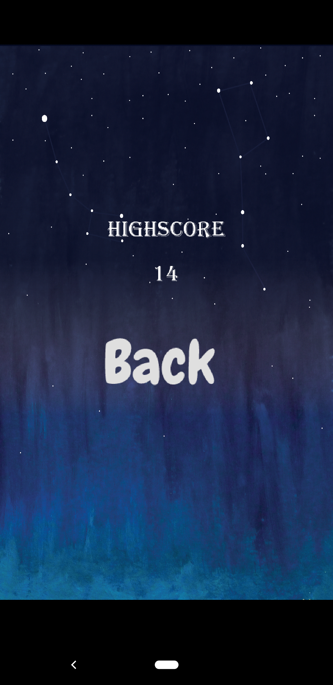
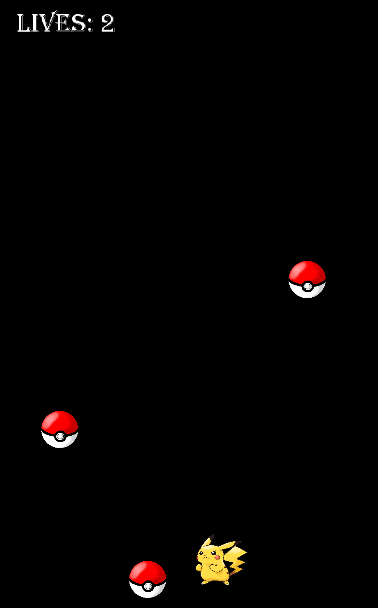
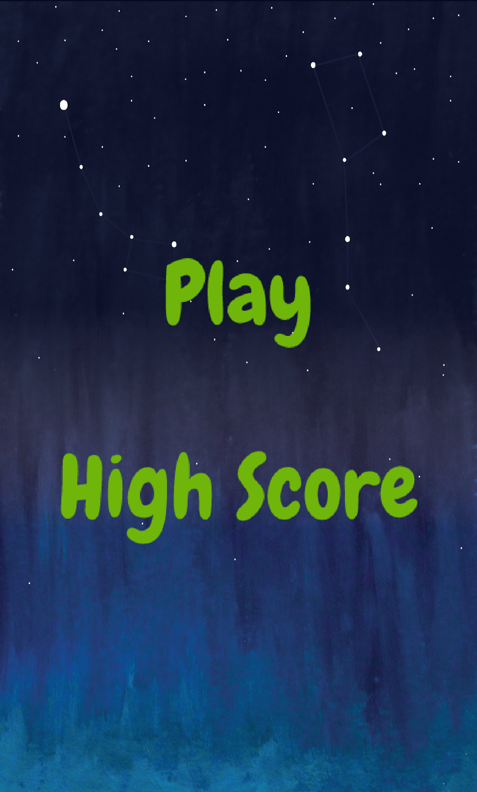

Dodge Pickachu !

This game is developed using LibGdx library in Android. The game has four Screens. 

There are four screens in game 
1. Menu Screen
2. Game Screen
3. HighScore screen
4. Option Screen.

The player of the game is a Pickachu character, which has 3 Lifes. Player have to be moved to avoid the falling Pokemons (obstacles). For each collision with obstacle the Life is reduced and on more then 3 collisions, the game restarts with 3 Lifes again. The player can only be moved left/right in horizontal direction. 

                                                                  
